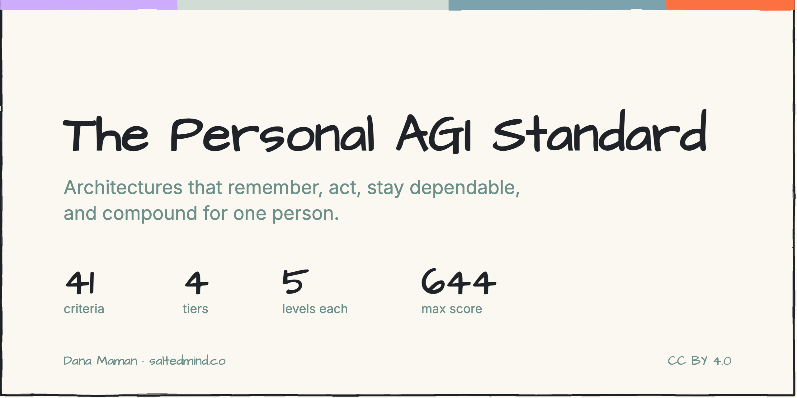
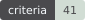
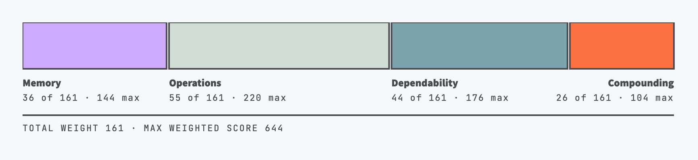
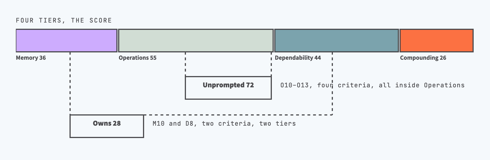
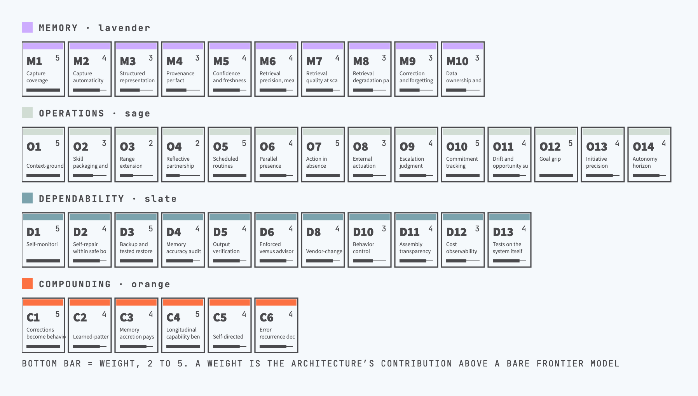
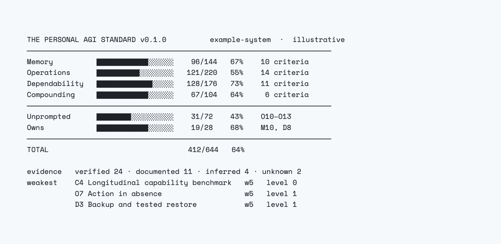

# The Personal AGI Standard

A maturity standard for personal AGI: architectures that remember, act,
stay dependable, and compound for one person.

[](CHANGELOG.md)
[](STANDARD.md)
[](STANDARD.md)
[](STANDARD.md)
[](LICENSE)
[](scripts/LICENSE)

## Personal AGI

A personal AGI is an intelligence layer that holds the operator's evolving
context, acts on their behalf, and is owned by them. Its capability compounds
as it integrates into their life, not only through access to their devices,
but by capturing their perspective. What it gives the operator is agency: the
range of what one person can decide and carry out, widened by a machine that
knows their context and stays under their direction.

## What the standard optimizes for

The standard optimizes for **one operator's leverage, with trust held
constant**. A personal AGI keeps one operator's context whole and applies
machine capability directly to it. The four tiers are the conditions for that:
nothing the operator knows or decides gets lost (Memory), work happens with
them and without them (Operations), output can be trusted without watching the
machinery (Dependability), and every month of use makes the next month better
instead of noisier (Compounding). Every criterion measures progress toward one
of those four promises. Intelligence is not the target: the model supplies it,
and the weight law below zeroes out anything a bare model already does.
Automation volume is not the target either: an autonomous system the operator
cannot trust or audit scores worse here, because leverage that must be
re-checked by hand is not leverage. Where two criteria pull against each
other, autonomy against control or output volume against verification, the tie
breaks toward the operator's trust.

## Why this exists

A personal AGI is buildable today, and almost nobody has one. The few who do
built it by hand, alone, with no map and no way to check the work against
anything but their own judgment. Machine capability is otherwise arriving as
something institutions own and individuals rent. A rented system hands the
individual the output and leaves the agency upstream, where someone else
decides what it remembers, what it does and what it refuses. Distributing it
matters more than any single system does, and a standard is how that happens:
private craft becomes a method that can be read, run, discussed and taught.

Some of that happens in the discussion. Operators who disagree about where a
level sits, who name a capability the map is missing, or who describe what
broke when they built it are what moves the standard. The rest happens in
public assessments. Each one is a real system described in shared terms, which
is how a level stops meaning one thing to its author and another to everyone
else, and how the gaps get found. The argument sets the criteria, published
results test whether they survive contact with real systems, and neither is
worth much without the other.

This standard is the map: 41 checkpoints that show an operator where they
stand and what to build next, so getting there stops requiring having already
figured it out alone.

The criteria are written to be handed to someone. An operator can read them
and see where their own system stands. An AI assistant can read them and
walk its operator through the same assessment. That is what the standard is
for beyond scoring: a shared method, precise enough to teach.

Very few people are building this today, and they are mostly building in
isolation. The same criteria let them compare what they have actually built,
argue about where a level sits, and propose what is still missing, in public
and on shared terms.

This is one person's first attempt at naming what the category needs, not a
final answer. Version 0.1.0 exists to be argued with. See
[CONTRIBUTING.md](CONTRIBUTING.md) to propose a criterion, dispute a weight,
or point out where the map is wrong.

## The four tiers

1. **Memory.** What the system collects and keeps about the operator: facts,
   interests, projects, decisions, preferences.
2. **Operations.** What it does with that memory: skills, agents, routines,
   loops. This tier scores the acting; staying healthy while acting is the
   next tier.
3. **Dependability.** Whether the output can be trusted without watching the
   machinery produce it. The engineering sense of the word: service delivery
   that is justifiably trusted, evidenced rather than asserted.
4. **Compounding.** Whether the system provably improves from accumulated
   memory and activity: day 300 better than day 30, on auditable evidence.



Two sub-groups cut across the tiers. Each is reported as an extra subtotal, in
addition to the tier totals and never instead of them, and changes no weight, no
level and no ID.

- **Unprompted**: is the system proactive? Work it initiates itself, plus
  the acceptance rate that decides whether that initiative is worth having.
  These are also the criteria nobody outside the system can check; see
  [LIMITS.md](LIMITS.md).
- **Owns**: what survives if every vendor withdraws? Memory kept in open
  formats the operator can take elsewhere, and a survived upstream change the
  operator did not choose. It is a subtotal and not a fifth tier because
  ownership does not change what the system can do today. A plain-text folder
  that does nothing scores well here and near zero everywhere else, and that
  is the correct result.



## Design rules

- **Criteria derive from function, not from any product.** Each was written
  by asking what the capability must do, before looking at who implements it.
- **An adversarial pass is mandatory.** At least 20% of criteria are written
  from rival architectures' worldviews (graph memory, benchmarked retrieval,
  enforced hooks, plain-files portability, cost-predictable stacks). The
  current set is 29% adversarial-sourced: 12 of 41. Each criterion's `origin`
  field says where it came from, and STANDARD.md lists the full vocabulary.
- **Levels and weights are fixed within a version, and freeze for good at
  1.0.0.** No score ever feeds back into a weight.
- **Weights follow one law:** a criterion's weight reflects the
  architecture's contribution above a bare frontier model with no system
  around it. Universally useful capabilities that a bare chat already
  provides weigh low. The full argument ships per criterion.
- **Unknown never rounds to zero.** Evidence tags are part of every score.
- **IDs are stable.** A number always points to the same criterion. Criteria
  are edited, re-weighted, added or retired; a retired ID is never reused, which
  is why the tier tables have gaps. STANDARD.md lists the retired IDs.



## Known limits

Three limits are structural: the weights are indexed to a baseline that moves
with every model release, assessments are self-reported and nothing here is
audited, and four of the 41 criteria (O10 to O13, worth 72 of the 644 points)
cannot be checked by anyone outside the system.
[LIMITS.md](LIMITS.md) states each one and what would remove it.

## How to use this standard

Two ways in, depending on whether you already have a personal AGI running.

**If you already run a personal AGI: use the standard as a progress bar.** Run
the assessment first. Run it even if you are not certain that what you have
counts as one, since 41 scored criteria answer that better than the label
does. Hand this repository to your AI assistant and say: "Follow ASSESS.md
and assess my system against this standard." [ASSESS.md](ASSESS.md) is a
machine-runnable protocol with explicit anti-flattery instructions, because an
assistant assessing its own operator's system is exactly the scenario where
grades inflate. Results land in `systems/<your-system>.yaml`. Then work the
result: the low-scoring criteria carrying the highest weights are where the
next month of work pays most. Re-run it after a few months of building, and
the difference between the two results is what the progress bar reads.



**If you have not built a personal AGI yet: use the standard as a build
order.** Read the criteria as a plan rather than as a test. The weights are
the guide: a criterion weighted 5 buys more than one weighted 2, and the
argument next to it says why. Nothing requires building in tier order, and no
operator needs every criterion. Pick the handful that matter for the work you
actually do and build those first. What matters most is starting. A system
that does one small thing every day teaches more than a plan for one that does
everything, and the criteria read differently once you have something running
to hold them against.

Scores stay absolute either way. Nothing is adjusted for your goals or budget,
because a score that moves with intent cannot be compared across systems. If a
criterion is genuinely not your aim, declare a target profile (see
STANDARD.md): a target level per criterion with a reason from a fixed
vocabulary. The gap between measured and target is public and disputable; the
measurement is not.

Publishing your result is optional and knowing where you stand is reason
enough to run it. Publishing is what turns one operator's private result into
evidence anyone can check, compare against and argue with, which is how the
levels get calibrated. No assessment is published yet, so `systems/` holds
only the template.

An assessment describes your own system, so its evidence lines can carry file
paths, tool names and business details. Read the file before you publish it
and redact what should stay private. An evidence line reading "scheduler
config, 6 jobs" carries the same weight as one that names every job.

## Repository layout

```
STANDARD.md          the standard, generated; do not edit directly
criteria/            the data: grammars, criteria, weights, retired IDs
systems/             published assessments, one file per system
scripts/build.py     regenerates STANDARD.md from the data
assets/              figures and badges used in the documentation
ASSESS.md            assessment protocol for AI assessors
CONTRIBUTING.md      how to dispute a criterion or submit an assessment
LIMITS.md            the structural limits of the instrument
CHANGELOG.md         versioned history of the standard itself
LICENSE              CC BY 4.0, for the standard and everything around it
scripts/LICENSE      MIT, for the build script
```

To re-weight and rebuild: edit `criteria/*.yaml`, then
`python3 scripts/build.py` (requires PyYAML).

## Status

Version 0.1.0, draft. The criteria set is complete: all 41 are written,
weighted and argued. Level definitions and weights can still change on
argument, and stop changing at 1.0.0, so that scores stay comparable across
years and no weight moves after someone has seen their result.

Structural disputes are what this stage is for: a missing criterion, a weight
that cannot be defended, a tier boundary in the wrong place.

## Author

Dana Maman ([saltedmind.co](https://saltedmind.co), Seasoned AI Strategy).
Builds and runs a production single-operator personal AGI, and builds them for
others. Ex-Microsoft.

Disputes and assessments belong in the issue tracker, where the argument stays
public. For anything that does not:
[personal-agi@saltedmind.co](mailto:personal-agi@saltedmind.co).

## License

The standard text, the criteria data, the documentation and the published
assessments are licensed under [CC BY 4.0](LICENSE): share and adapt them for
any purpose, including commercially, with credit, a link to the license, and a
note of what you changed. The build script in `scripts/` is software and is
licensed separately under the [MIT License](scripts/LICENSE).

When citing or republishing, this is the attribution that works:

> The Personal AGI Standard by Dana Maman (https://saltedmind.co), licensed
> under CC BY 4.0.

A license covers copyright, not names. "The Personal AGI Standard" is the name
of this project; forks and adaptations are welcome under a name of their own,
so that a score always refers to a known version of a known instrument.
